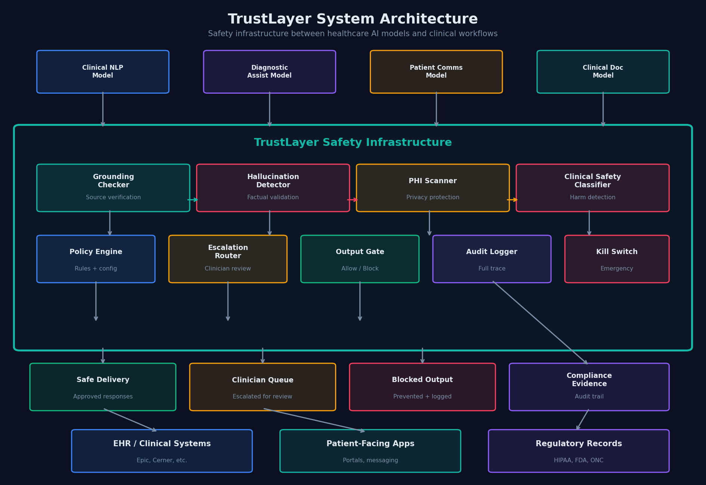
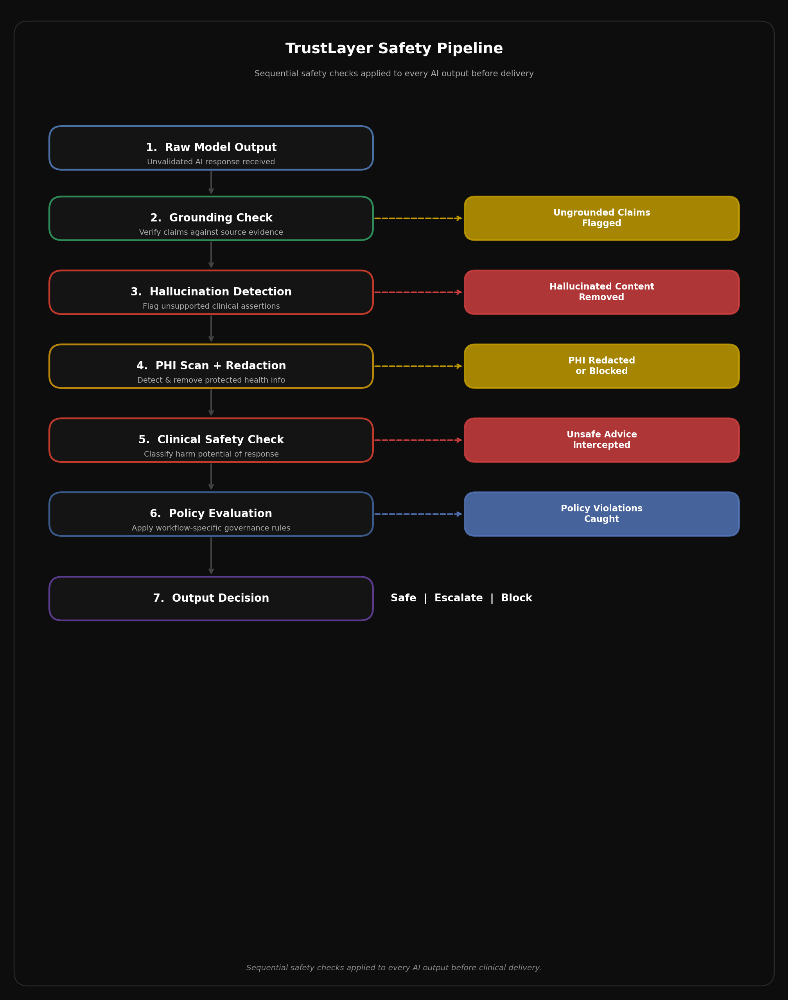
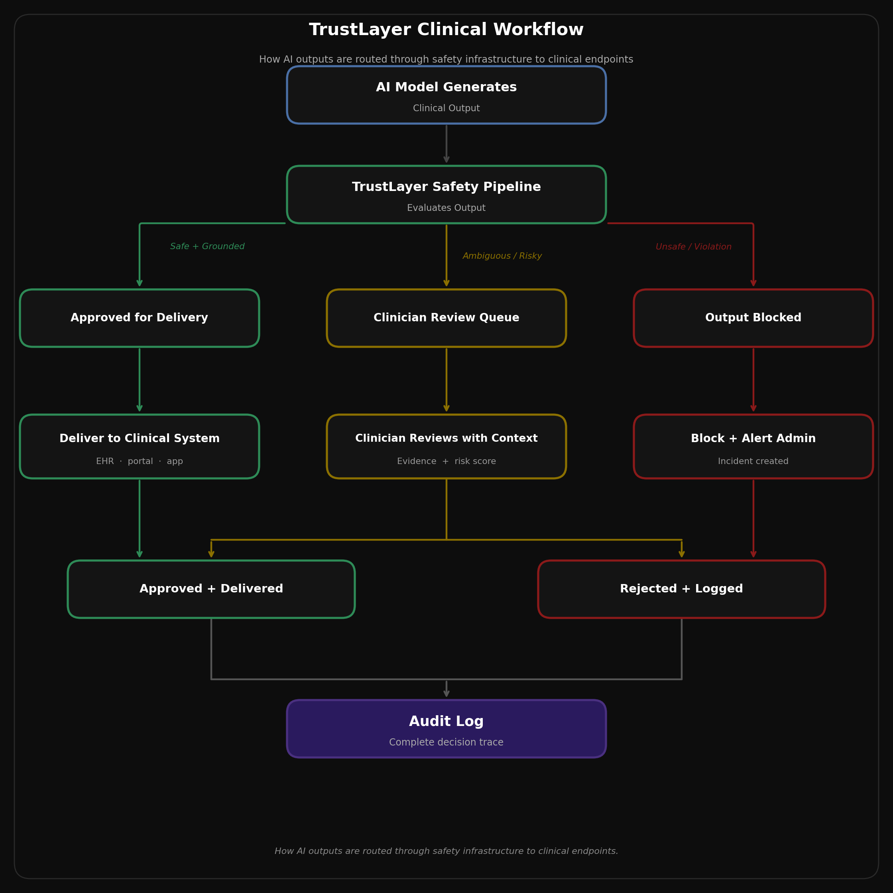
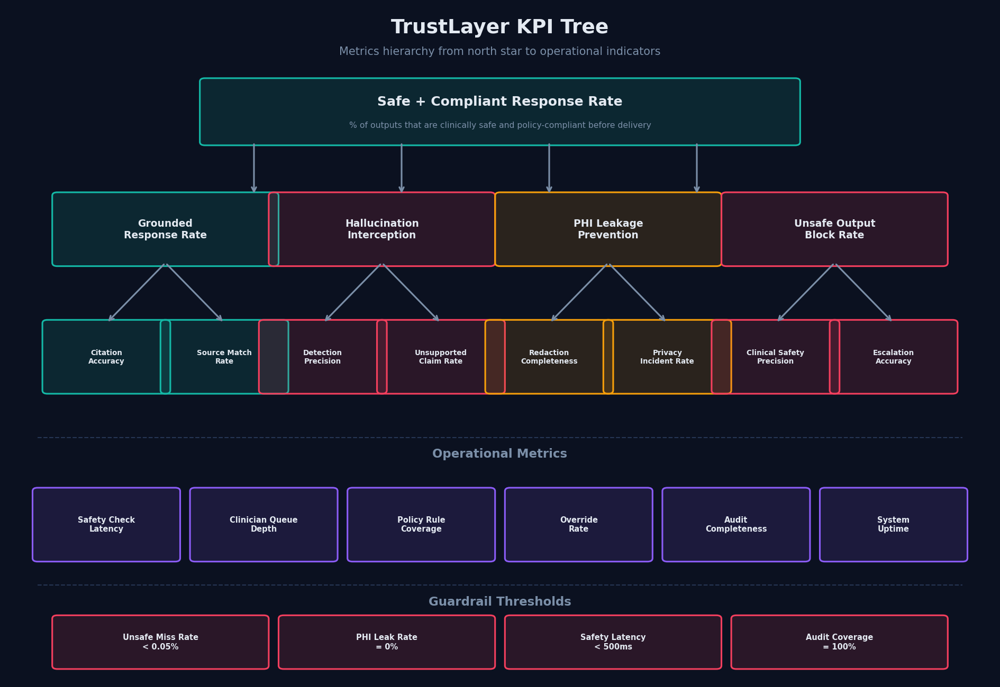
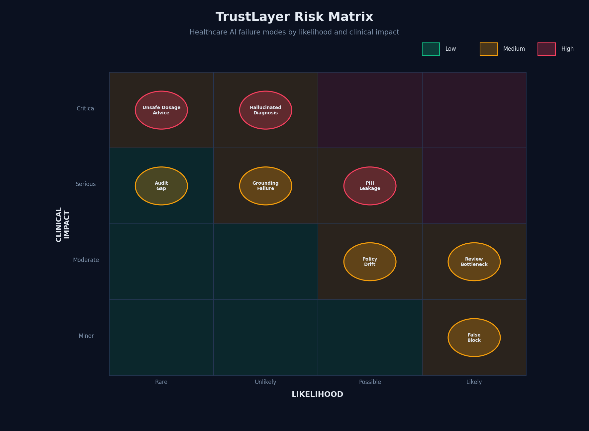

# TrustLayer: Safe-by-Design AI Infrastructure for Healthcare

**A product case study in healthcare AI safety and governance.**

---

## Executive Summary

Healthcare organizations are adopting AI across clinical workflows: summarizing patient records, drafting clinical notes, answering patient questions, supporting diagnostic reasoning, generating prior authorization letters. The models behind these workflows are getting better fast. But "better" is not the same as "safe enough to put in front of patients and clinicians without guardrails."

The problem is specific. A model that hallucinates a drug interaction, leaks a patient's diagnosis into a response it should not have included, or generates dosage guidance that contradicts clinical evidence can cause real harm. Not reputational harm. Clinical harm.

TrustLayer is a safety and governance infrastructure layer that sits between healthcare AI models and the clinical systems, patient portals, and workflows they feed into. It checks every AI output for grounding, hallucination, PHI exposure, and clinical safety before that output is allowed to reach anyone. Outputs that pass are delivered. Outputs that are ambiguous are escalated to a clinician reviewer. Outputs that are unsafe are blocked. Everything is logged.

This is not a model improvement project. It is an infrastructure project. The insight is that no single model will be safe enough on its own for healthcare, and the safety controls need to live outside the model, in a layer that is independently auditable, configurable, and enforceable.

---

## Problem

Healthcare AI is being deployed into workflows where the outputs directly affect patient care. This creates a category of risk that does not exist in most other AI applications:

**Hallucinated clinical content.** A model asked to summarize a patient's medication history invents a drug the patient was never prescribed. A clinician trusts the summary. The invented medication creates a contraindication that changes the treatment plan. This is not a theoretical scenario. It is a known behavior of current-generation language models, and it happens more often with medical terminology than with general knowledge because medical facts are dense, context-dependent, and easy to confuse.

**PHI leakage.** A model used for patient communication inadvertently includes protected health information in a response that gets routed to the wrong recipient, or surfaces PHI in a context where it should have been redacted. HIPAA violations carry real financial penalties and erode patient trust in the institution.

**Unsafe clinical guidance.** A model generating patient-facing health information recommends a dosage, suggests a treatment contraindicated for the patient's condition, or provides advice that falls outside the scope of what the AI system was designed to do. The patient does not know the difference between a validated clinical recommendation and a model's best guess.

**No auditability.** When something goes wrong, there is no trace of what the model generated, what safety checks it passed or failed, why it was delivered, and who saw it. Regulatory bodies (HIPAA, FDA, ONC) expect documented governance for automated systems that touch clinical data. Most healthcare AI deployments have no such documentation.

The core issue is that healthcare organizations are inserting AI outputs into high-stakes workflows and relying on the model itself to be safe. That is not a viable strategy. Models are probabilistic systems. They will produce unsafe outputs. The question is what happens between the model's output and the patient.

---

## Why Now

**Clinical AI deployment is accelerating.** Epic, Oracle Health (Cerner), and other major EHR vendors are integrating AI features into clinical workflows. Health systems are building custom AI tools on top of foundation models. The volume of AI-generated clinical content reaching patients and clinicians is growing rapidly.

**Regulatory expectations are crystallizing.** The FDA is actively developing guidance for clinical decision support software and AI/ML-based medical devices. ONC's Health IT Certification Program increasingly expects transparency and auditability for AI-assisted tools. HIPAA requirements apply to any system that touches PHI, including AI systems that process or generate text containing it.

**Incident visibility is increasing.** Published case studies and internal reports from early healthcare AI adopters document hallucinated medical information, PHI exposure in AI-generated content, and clinician over-reliance on AI outputs that were not validated. These are not edge cases anymore. They are recurring patterns.

**The model layer alone cannot solve this.** Fine-tuning, RLHF, and prompt engineering reduce but do not eliminate unsafe outputs. Healthcare needs defense-in-depth: multiple independent safety checks that catch what the model misses. This is the same principle that governs pharmaceutical safety (multiple quality checks before a drug reaches a patient) and aviation safety (redundant systems). Healthcare AI needs the equivalent infrastructure.

---

## Users and Buyers

| Role | Need |
|------|------|
| **Clinical Informatics Teams** | Validate that AI outputs meet clinical safety standards before reaching patients or clinicians |
| **Health IT / Platform Engineering** | Integrate safety infrastructure into existing clinical AI pipelines without rebuilding each tool |
| **Compliance / Privacy Officers** | Produce audit evidence showing AI outputs are governed, PHI is protected, and incidents are traceable |
| **CMIO / CISO (Buyers)** | Demonstrate to regulators and the board that clinical AI is deployed responsibly |
| **Clinician Reviewers** | Review escalated AI outputs with sufficient context to make a fast, informed decision |

---

## Product Concept

TrustLayer is a safety infrastructure layer that intercepts every AI-generated output in a healthcare workflow and runs it through a pipeline of safety checks before allowing delivery.

It is not a model. It is not a fine-tuning service. It is not a prompt engineering framework. It is the infrastructure between the model and the clinical world.

For every AI output, TrustLayer determines:
1. Is this output grounded in source evidence?
2. Does it contain hallucinated clinical content?
3. Does it expose protected health information?
4. Could it cause clinical harm?
5. Does it comply with the organization's governance policies for this workflow?

Based on these checks, the output is delivered, escalated to a clinician, or blocked.

---

## How TrustLayer Works

### Safety Pipeline

Every AI output passes through a sequential safety pipeline before it can reach a clinical endpoint:

**Stage 1: Grounding Check.** Verifies that claims in the AI output are traceable to source documents (patient records, clinical guidelines, formulary data). Ungrounded claims are flagged with a confidence score.

**Stage 2: Hallucination Detection.** Identifies assertions that are not supported by any provided evidence. This includes fabricated medications, invented lab values, and clinical facts that contradict the source material. Detection uses a combination of entailment checking against source documents and cross-reference against structured medical knowledge bases.

**Stage 3: PHI Scan and Redaction.** Scans the output for 18 HIPAA identifier categories. PHI that should not appear in the output context is redacted or triggers a block. This is not a simple regex scan; it uses entity recognition tuned for clinical text, which contains PHI patterns (MRNs, provider names, dates of service) that general-purpose PII detectors miss.

**Stage 4: Clinical Safety Classification.** Evaluates whether the output could cause clinical harm. This includes unsafe medication recommendations, dosage errors, contraindicated treatment suggestions, and advice that exceeds the intended scope of the AI system. Classification uses a combination of rule-based checks (drug interaction databases, dosage ranges) and a fine-tuned safety classifier.

**Stage 5: Policy Evaluation.** Applies organization-specific and workflow-specific governance rules. Examples: "Patient-facing responses must not include specific dosage numbers," "Diagnostic suggestions must include a disclaimer," "Prior auth letters must cite clinical criteria." Policies are configurable per workflow, per department, and per AI model.

### Output Routing

Based on the pipeline results, each output receives one of three dispositions:

| Disposition | Criteria | What Happens |
|-------------|----------|--------------|
| **Approved** | All checks pass; risk score below threshold | Output delivered to clinical endpoint |
| **Escalated** | Ambiguous findings; moderate risk | Routed to clinician review queue with full context |
| **Blocked** | Safety violation detected; high risk | Output prevented; admin alerted; incident logged |

### Audit Trail

Every output that passes through TrustLayer generates a complete audit record: the raw model output, each safety check result, the risk score, the routing decision, the policy version, and (if escalated) the reviewer's decision and rationale. This is the compliance evidence that healthcare organizations need for HIPAA, FDA, and institutional review.

---

## Safety and Governance Logic

TrustLayer's governance model is designed around five principles that reflect how safety works in healthcare, not in software:

**1. Do no harm by default.** If the safety pipeline cannot confidently determine that an output is safe, the output does not reach the patient or clinician. This is the healthcare equivalent of "default deny." In clinical contexts, the cost of delivering an unsafe output far exceeds the cost of blocking a safe one.

**2. Evidence-based validation.** Every clinical claim in an AI output should be traceable to a source. If a model asserts that a patient takes metformin, there should be a medication list that confirms it. If a model recommends a treatment approach, there should be a guideline or clinical note that supports it. Ungrounded claims are not necessarily wrong, but they are not verifiable, and in healthcare, unverifiable is not acceptable.

**3. Privacy is non-negotiable.** PHI protection is not a "nice to have" guardrail. It is a legal requirement. TrustLayer treats any PHI exposure in an unauthorized context as a blocking event, not a warning. The threshold for privacy violations is zero tolerance.

**4. Clinician authority.** When the system escalates an output, the clinician reviewer has full authority to approve, modify, or reject it. The system provides context and risk signals, but the clinical judgment belongs to the human. Overrides are documented, not prevented.

**5. Full traceability.** Every AI output, every safety check, every routing decision, and every clinician override is recorded. When a regulator, risk manager, or patient safety officer asks "what happened with this AI-generated content," the answer must be complete and retrievable.

---

## Key Metrics

**North Star Metric**: Safe and Compliant Response Rate. The percentage of healthcare AI outputs that are both clinically safe and policy-compliant before they reach any clinical endpoint. Measured by a combination of automated checks and weekly expert review of a stratified sample.

**Proposed supporting targets** (for initial rollout, subject to calibration from pilot data):
- Grounded response rate: > 95% of clinical claims traceable to source evidence
- Hallucination interception rate: > 99% of fabricated clinical content caught before delivery
- PHI leakage prevention rate: 100% (this is a zero-tolerance guardrail)
- Unsafe output block rate: > 99.5% of clinically harmful outputs intercepted
- Clinician escalation precision: > 80% of escalated outputs genuinely warrant human review
- Safe response latency: < 500ms additional latency per output (healthcare workflows tolerate more latency than real-time consumer apps, but not unlimited)

**Recommended guardrail thresholds**:
- Clinically unsafe miss rate: < 0.05% (an unsafe output that makes it through the pipeline to a patient or clinician)
- PHI incident rate: 0% (any PHI leak in an unauthorized context is a guardrail breach)
- Audit coverage: 100% (every output has a complete safety trace)
- False-positive block rate: < 10% (monitored as a signal that safety checks are over-aggressive)

**Drift signals** (monitored, no fixed targets):
- Clinician override rate: tracked as a signal that safety classifications and clinician judgment are diverging
- Review queue depth: tracked to detect bottleneck risk before it becomes operational

---

## Rollout Approach

| Phase | Timeline | Scope |
|-------|----------|-------|
| **Phase 1: MVP** | Months 1 to 5 | Grounding checks, hallucination detection, PHI scanning, clinical safety classification, clinician escalation queue, audit logging. Single AI workflow (e.g., patient message drafting), single department. |
| **Phase 2: Expansion** | Months 6 to 10 | Configurable policy engine, safety dashboards, improved evidence validation, workflow-specific safety profiles. Multiple workflows, multiple departments. |
| **Phase 3: Platform** | Months 11 to 16 | EHR integration (Epic, Oracle Health), adaptive safety thresholds, compliance reporting automation, multi-model governance, enterprise-wide deployment. |

Phase 1 starts with a single, well-bounded AI workflow in a single clinical department. The goal is to validate the safety pipeline against real clinical AI outputs before expanding scope. Patient message drafting is a strong candidate: high volume, moderate clinical risk, clear grounding sources (the patient's chart), and a natural clinician review step that already exists in most organizations.

Each phase follows a shadow-mode, advisory-mode, enforcement-mode progression. Shadow mode runs the safety pipeline on live outputs without blocking anything, so the clinical informatics team can evaluate detection accuracy against real data. Advisory mode surfaces safety signals to clinicians without hard-blocking. Enforcement mode activates blocking and mandatory escalation.

---

## Risks

| Risk | Severity | Mitigation |
|------|----------|------------|
| Hallucinated clinical content reaches a patient | Critical | Multi-stage detection pipeline; conservative initial thresholds; mandatory shadow mode |
| PHI leakage through AI-generated output | Critical | Zero-tolerance blocking; healthcare-specific entity recognition; redaction before delivery |
| Unsafe dosage or treatment advice delivered | Critical | Drug interaction DB cross-reference; dosage range checking; clinical safety classifier |
| False-positive blocking disrupts clinical workflow | High | Precision monitoring; threshold calibration during shadow mode; clinician feedback loop |
| Clinician review bottleneck at scale | High | Escalation precision targeting > 80%; queue management; SLA-based routing |
| Grounding checker fails on complex clinical narratives | Medium | Iterative improvement using clinician feedback; known-limitation documentation |
| Policy drift as clinical guidelines evolve | Medium | Quarterly policy review; clinical advisory board engagement; policy expiration dates |
| Audit gaps in safety trace | High | Synchronous logging before output delivery; daily integrity verification |

---

## PM Takeaway

The product insight behind TrustLayer is that healthcare AI safety is not a model problem. It is an infrastructure problem.

You can make models better through fine-tuning, RLHF, better prompts, and retrieval augmentation. All of that helps. But none of it eliminates the possibility of unsafe outputs. In healthcare, "low probability of harm" is not the same as "safe." You need a separate layer that catches what the model misses, and that layer needs to be independently auditable, configurable per workflow, and governed by people who understand clinical risk.

The PM challenge is designing safety infrastructure that is strict enough to prevent real clinical harm, practical enough to not shut down every AI workflow with false positives, and transparent enough to satisfy regulators who are still figuring out how to govern this space. That balance does not come from a single threshold or a single detection model. It comes from a pipeline of checks, each catching different failure modes, with human clinicians as the final backstop for ambiguous cases.

The hardest open question is calibration. Healthcare has near-zero tolerance for certain failure modes (PHI leakage, unsafe dosage advice) but cannot practically operate if the safety layer blocks 30% of outputs. Finding the right sensitivity for each check, per workflow, per clinical context, is the core operating challenge. It is also the reason a configurable policy engine is Phase 2 and not Phase 1: you need real data from real clinical workflows before you can build a policy system that generalizes.

---

## Supporting Documents

| Document | Description |
|----------|-------------|
| [Executive One-Pager](executive-one-pager.md) | Leadership summary |
| [Strategy Memo](strategy-memo.md) | Strategic product rationale |
| [Product Requirements](prd.md) | Detailed PRD |
| [Metrics Framework](metrics-framework.md) | KPI hierarchy and targets |
| [Roadmap](roadmap.md) | 3-phase delivery plan |
| [Risk & Governance](risk-and-governance.md) | Failure modes and governance principles |
| [Case Study PDF](trustlayer-case-study.pdf) | Executive version |

---

*Product case study demonstrating strategic thinking, clinical domain depth, and healthcare-grade safety infrastructure design.*
